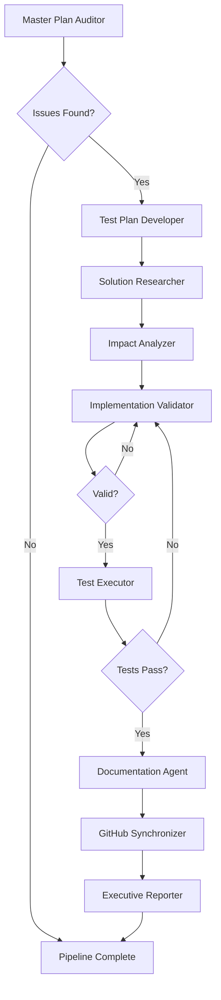

# Agent Orchestration Pipeline Documentation

## Overview

The Agent Orchestration Pipeline is an automated development system that uses specialized AI agents to implement features with Objective Qualified Evidence (OQE) at every step. This system replaces ad-hoc development with a structured, evidence-based approach.

## Key Principles

### 1. Objective Qualified Evidence (OQE)
Every claim must be backed by:
- **Verified**: Objectively verified with data
- **Measured**: Quantified with metrics
- **Documented**: Written evidence (minimum acceptable)
- **Never Assumed**: No evidence = not acceptable

### 2. Brutal Honesty
Agents provide:
- Blunt assessments with evidence
- No sugar-coating of problems
- Clear identification of failures
- Specific, actionable recommendations

### 3. Master Plan Adherence
- Strict alignment with DEVELOPMENT_MASTER_PLAN.md
- Detection of scope creep
- Prevention of "pie in the sky" features
- Focus on planned objectives

## Pipeline Agents

### 1. Master Plan Auditor
**Purpose**: Verify project alignment and GitHub accuracy
- Reads DEVELOPMENT_MASTER_PLAN.md
- Checks version and issue status
- Verifies GitHub synchronization
- Detects out-of-scope features

### 2. Test Plan Developer
**Purpose**: Create comprehensive test plans with OQE requirements
- Generates test cases with metrics
- Defines preconditions/postconditions
- Specifies measurement requirements
- Creates organized test structure

### 3. Solution Researcher
**Purpose**: Research multiple implementation approaches
- Analyzes different architectures
- Scores approaches on complexity/maintainability
- Considers codebase patterns
- Recommends best approach

### 4. Impact Analyzer
**Purpose**: Analyze codebase impact of changes
- Identifies affected files
- Calculates impact score
- Assesses risk areas
- Recommends implementation agent

### 5. Implementation Validator
**Purpose**: Validate implementation meets specifications
- Code quality checks
- Specification compliance
- Performance benchmarks
- Integration verification

### 6. Test Executor
**Purpose**: Execute tests and verify OQE compliance
- Runs test plan
- Collects evidence
- Measures performance
- Verifies OQE standards

### 7. Documentation Agent
**Purpose**: Create and organize documentation
- API documentation
- Test reports by scene/feature
- User guides
- Changelog updates

### 8. GitHub Synchronizer
**Purpose**: Synchronize with GitHub repository
- Stage and commit changes
- Push to remote
- Update issue status
- Create pull requests

### 9. Executive Reporter
**Purpose**: Generate brutally honest summary
- Analyze pipeline execution
- Calculate success metrics
- Identify critical issues
- Provide final verdict

## Usage

### Command Line
```bash
# Process a specific issue
python run_agent_pipeline.py 29

# Dry run mode (no changes)
python run_agent_pipeline.py 29 --dry-run

# Specify project root
python run_agent_pipeline.py 29 --project-root /path/to/project
```

### Programmatic
```python
from src.orchestration import CompleteOrchestrationController

# Initialize controller
controller = CompleteOrchestrationController(".")

# Execute for an issue
report = controller.execute_full_development_cycle(issue_number=29)
```

## Pipeline Flow



## Evidence Requirements

### Test Evidence Structure
```json
{
  "preconditions": {
    "system_state": "initial",
    "configuration": {...}
  },
  "measurements": {
    "execution_time_ms": 45.2,
    "memory_before_mb": 120.5,
    "memory_after_mb": 125.3
  },
  "postconditions": {
    "system_state": "updated",
    "output": {...}
  }
}
```

### OQE Scoring
- 90-100%: Excellent - Production ready
- 80-89%: Acceptable - Minor improvements needed
- 70-79%: Poor - Significant work required
- <70%: Unacceptable - Major rework needed

## Output Structure

### Pipeline Reports
Reports are saved to `pipeline_reports/` with structure:
```
pipeline_reports/
├── issue_29_pipeline_report_20250803_143022.json
├── issue_30_pipeline_report_20250803_151545.json
└── ...
```

### Test Plans
Test plans are organized by issue in `test_plans/`:
```
test_plans/
├── templates/
│   └── oqe_test_plan_template.json
├── issue_29_test_plan.json
├── issue_30_test_plan.json
└── ...
```

### Documentation
Generated docs are organized by scene and feature:
```
docs/
├── api/
│   ├── abilities.md
│   └── ability_manager.md
├── test_reports/
│   ├── pool/
│   ├── ski/
│   ├── vegas/
│   └── drive/
└── guides/
    └── using_character_abilities.md
```

## Executive Summary Format

The pipeline produces an executive summary including:

1. **Overall Status**: Success rate percentage
2. **OQE Compliance**: Evidence quality score
3. **Agent Checklist**: Each agent's execution status
4. **Critical Findings**: Major issues found
5. **Evidence Summary**: Breakdown of evidence types
6. **Development Metrics**: Execution statistics
7. **Action Items**: Next steps
8. **Brutal Verdict**: Honest assessment

## Best Practices

### 1. Always Start Fresh
- Run Master Plan Auditor first
- Ensure GitHub is synchronized
- Check for pending changes

### 2. Review Test Plans
- Verify OQE requirements
- Check measurement definitions
- Ensure comprehensive coverage

### 3. Monitor Evidence Quality
- Aim for 100% OQE compliance
- Prefer verified/measured over documented
- Never accept assumed evidence

### 4. Act on Warnings
- Critical warnings block progress
- Address all issues before proceeding
- Don't ignore brutal assessments

### 5. Document Everything
- Keep pipeline reports
- Archive test evidence
- Track improvement over time

## Troubleshooting

### Pipeline Blocked
- Check agent warnings
- Review OQE scores
- Verify prerequisites met

### Low OQE Scores
- Add more measurements
- Verify evidence collection
- Improve test specifications

### GitHub Sync Issues
- Check credentials
- Verify branch status
- Resolve conflicts

## Integration with CI/CD

The pipeline can be integrated into CI/CD:

```yaml
# GitHub Actions example
- name: Run Development Pipeline
  run: |
    python run_agent_pipeline.py ${{ github.event.issue.number }}
  env:
    GITHUB_TOKEN: ${{ secrets.GITHUB_TOKEN }}
```

This ensures all development follows the same rigorous, evidence-based process.